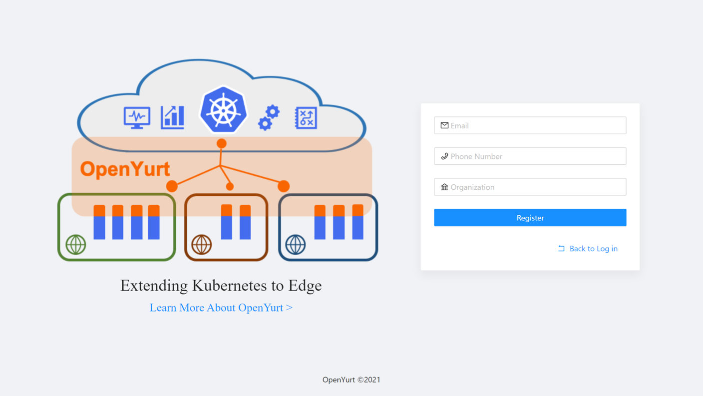
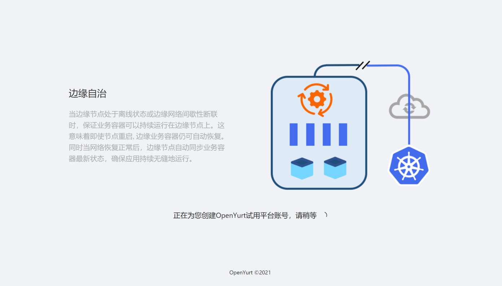
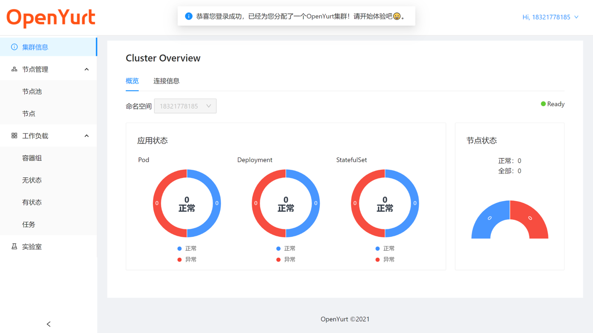

> 这份文档将介绍如何使用 yurt-dashboard 的用户管理功能

用户第一次使用体验平台，需要注册一个平台账号。

注册账号需要您提供三项信息

- 邮箱
- 电话
- 公司

> 注意：
>
> - 邮箱与电话信息需要符合对应的格式。
> - 填写的电话信息将作为您之后登录的用户名，所以同一个电话不能注册两个账户。

三项信息填写完毕后，点击注册按钮。

注册过程中，系统除了需要创建新用户账户外，还需要为您创建相应的集群资源，所以可能需要稍微等待 3-5s.

创建成功后，用户的账户信息将会展示到界面上。

> 注意：请您妥善保管界面上展示的 token 信息，该 token 之后将作为您账户的密码使用。

注册失败时，请注意界面上显示的错误信息。如果可以排除网络问题和重复注册问题，请向[OpenYurt 社区](https://github.com/openyurtio/openyurt#contact)反馈该问题（也可以直接在 yurt-dashboard 的仓库[提交 issue](https://github.com/openyurtio/yurt-dashboard/issues)）。

当注册成功后，点击 Go to Login 按钮即可回到登录页面
。新账户的用户名和密码已经为您自动填充进去了，您可以使用浏览器提供的“记住密码”功能，将密码信息保存在浏览器中。另外，Remember me 按钮会自动勾选 ✔，当其处于 check 的状态，您下次访问体验平台将自动登录。

点击登录按钮后，不出意外的话，您将得到一个属于自己的 OpenYurt 集群。可以看到集群现在还没有应用和节点（或者只有一个不可见的 Master 节点），您将在接下来的文档中看到如何[使用 web console](./web_console.md)以及[kubeconfig](./kubeconfig.md)来体验 OpenYurt 的能力。

另外，您还可以在右上角的用户信息栏中看到账户的有效期信息，并退出当前账户。

