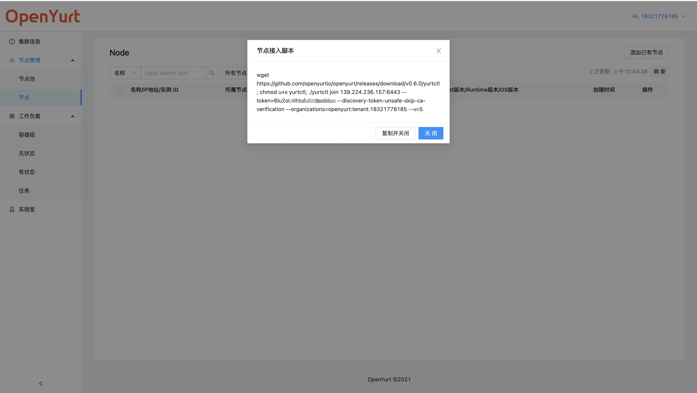
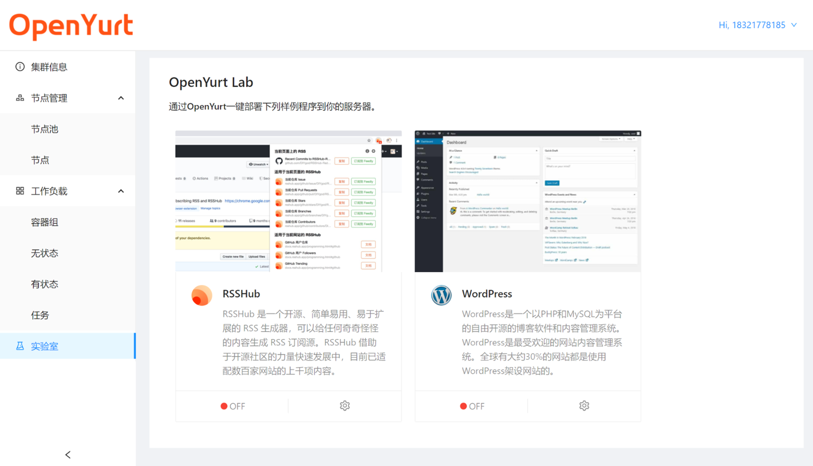
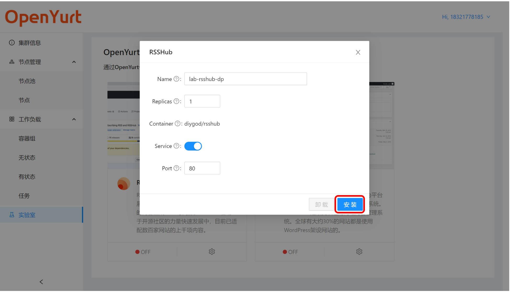

> 这份文档将介绍如何使用 yurt-dashboard 提供的 Web 控制台的基本功能。

## UI Overview

打开控制台，进入的第一个页面展示的是“集群信息”——包括应用状态，节点状态，dashboard 连接状态，以及为用户分配的命名空间（每个用户只能在各自的命名空间活动，详细介绍请参考设计文档）。

页面右侧是控制台的导航栏，除了展示集群信息外，控制台还提供节点管理，工作负载管理以及实验室等功能。

## join node

> 用户可以通过控制台获取节点接入脚本，将自己的节点接入 OpenYurt 集群，体验 OpenYurt 的功能。

1. 打开“节点管理-节点”页面，点击添加已有节点按钮。

2. 此时，界面将弹出一个对话框，展示节点接入脚本，点击复制。

3. 用户在自己的节点上执行复制的脚本 （注意：如果yurtctl下载较慢，也可通过 [此方法](https://openyurt.io/docs/next/installation/yurtctl-init-join/#21%E7%BC%96%E8%AF%91-yurtctl) 自己编译 v0.6.0+ 的`yurtctl`, 之后执行节点加入脚本的`./yurtctl join ...` 部分即可）

4. 执行成功后，可以在命令行中看到`This node has joined the cluster`的提示信息。另外，此时刷新控制台的节点页面，也能看到加入的节点。

## OpenYurt Lab

> 为了进一步降低新用户的使用门槛，控制台还提供了一个“实验室”模块，让用户可以快速部署应用到自己的 OpenYurt 集群上。

1. 打开“实验室”页面，目前 OpenYurt 提供了两个示例应用，之后会逐步扩充实验室的功能。

2. 点击想要部署的应用右下方的设置按钮，自定义应用的设置（如 Deployment 的名称，副本数目，是否创建对应 Service 等选项）。设置完成后，点击安装按钮，即可自动部署应用。

3. 创建成功后，页面会弹出`install app xxx successfully`成功创建提示信息。并且在“容器组”和“无状态”页面可以看到对应 Deployment 和 Pod 的详细信息。

4. 另外，用户也可以直接在控制台的“实验室”页面中卸载安装的应用。

